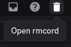
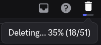
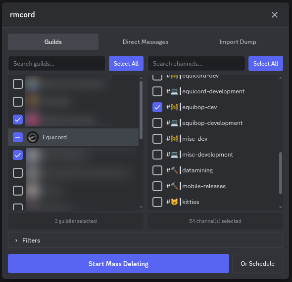
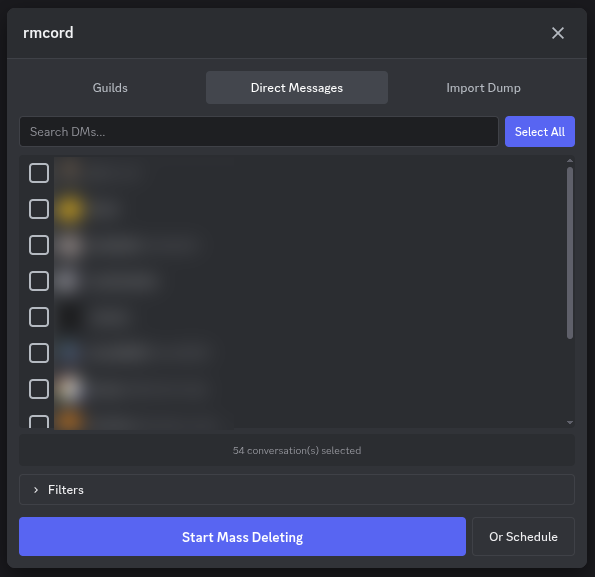
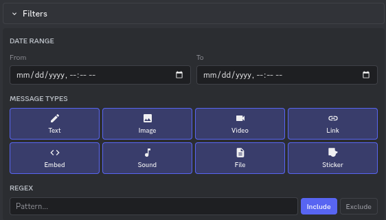
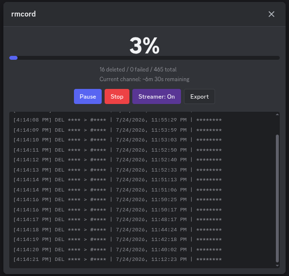

# rmcord

> **Disclaimer:** Any tool that automates actions on user accounts, including this one, may violate Discord's Terms of Service and could result in account suspension or termination. Use at your own risk. See [LEGAL.md](LEGAL.md) for full details.

A [Vencord](https://github.com/Vendicated/Vencord) / [Equicord](https://github.com/Equicord/Equicord) plugin that lets you bulk-delete your own Discord messages from a floating panel. Works across guilds, channels, and direct messages.

## Features

- Mass delete your own messages from any guild, channel, or DM
- Import your Discord data package to delete messages from guilds you've already left
- Pick specific channels or select entire guilds at once
- Filter by date/time range, message type (text, image, video, link, embed, sound, file, sticker), and regex pattern
- Schedule deletions for a future date and time
- Pause, resume, and stop deletion at any time
- Background deletion that keeps running when the panel is closed
- Live progress indicator on the toolbar button
- Per-channel ETA showing estimated time remaining
- Streamer mode to redact identifiable information from the log view
- Export structured deletion logs as a text file
- Adaptive rate limit handling with automatic backoff and recovery
- Archived thread detection to avoid repeated failures on locked threads
- Search index awareness that waits for Discord's index to catch up after deletions

## Installation

You need to build Vencord or Equicord from source. The plugin goes in `src/userplugins/`, which is the designated location for personal plugins that aren't tracked by git.

### Prerequisites

- [Git](https://git-scm.com)
- [Node.js](https://nodejs.org) 22 or later
- [pnpm](https://pnpm.io) (enable via `corepack enable`)

### Step 1: Clone Vencord or Equicord

If you haven't already, clone the repo and install dependencies:

```sh
# Vencord
git clone https://github.com/Vendicated/Vencord.git
cd Vencord
pnpm install

# or Equicord
git clone https://github.com/Equicord/Equicord.git
cd Equicord
pnpm install
```

### Step 2: Add the plugin

Create the `userplugins` directory if it doesn't exist, then clone this repo into it:

```sh
mkdir -p src/userplugins
cd src/userplugins
git clone https://github.com/max/rmcord.git
```

The plugin must be in its own folder with an `index.tsx` entry point. The final path should look like:

```
Vencord/src/userplugins/rmcord/index.tsx
```

### Step 3: Build and restart

Build from the repo root:

```sh
cd ../..
pnpm build
```

Restart Discord. The plugin should appear in your plugin settings as "rmcord". Enable it and you'll see a trash icon in the channel toolbar.

### Web extension (Chrome/Firefox)

If you use Discord in the browser instead of the desktop client:

```sh
pnpm buildWeb
```

Then load the unpacked extension from `dist/chromium-unpacked` (Chrome/Edge) or `dist/firefox-unpacked` (Firefox).

### Updating the plugin

`git pull` doesn't update user plugins. To update rmcord:

```sh
cd src/userplugins/rmcord
git pull
cd ../../..
pnpm build
```

Then restart Discord.

## Development

### Setup

Follow the same installation steps above, then use the watch build for faster iteration:

```sh
pnpm buildWeb --watch
```

This rebuilds automatically on file changes. Load the unpacked extension from `dist/chromium-unpacked` and reload the extension after each rebuild. You can work directly in `src/userplugins/rmcord/`.

### Project structure

```
rmcord/
  index.tsx           - Plugin entry point, panel, toolbar button
  utils.tsx           - Deletion engine (search, delete, rate limiting, filters)
  styles.css          - All CSS (Discord variables with dark theme fallbacks)
  ui/
    components/
      Checkbox.tsx    - Custom checkbox with indeterminate state
      icons/          - SVG icon components
    GuildsTab.tsx     - Guild/channel selection (split panel)
    DirectMessagesTab.tsx - DM selection
    ImportTab.tsx     - Data dump import
    FiltersPanel.tsx  - Date range, type, and regex filters
    ProgressView.tsx  - Progress bar, logs, controls
```

## FAQ

**Can I get banned for using this?**

Yes. Automating actions on a user account can be considered self-botting, which violates Discord's Terms of Service. This applies to any deletion tool, not just this one. Use at your own discretion.

**Why does deletion seem slow?**

Discord rate limits all API actions. The plugin respects those limits and uses adaptive delays to avoid getting your account flagged. If you get rate limited, the plugin automatically backs off and recovers. A 10-second delay between search pages is intentional -- Discord's search index needs time to update after deletions, and searching too fast leads to empty or inconsistent results.

**Can I use Discord while it's running?**

Yes. Deletion runs in the background even when the panel is closed. You can reopen it by clicking the trash icon to check progress. Avoid sending messages in channels that are actively being deleted, as it can temporarily disrupt the search index.

**What happens if I close or switch channels?**

The deletion keeps running. The toolbar icon shows a progress bar while a deletion is active. Click it to reopen the panel and see full progress, pause, or stop.

**What is the data package import for?**

If you've left a guild, Discord's search API can't find your messages there anymore. But your Discord data package (Settings > Privacy > Request Data) contains a `messages/index.json` file that maps channel IDs to names. Import that file and rmcord can delete messages from those channels directly.

**What does streamer mode do?**

It redacts guild names, channel names, usernames, and message content from the progress log, so you can share your screen or record without exposing private information. The exported log file always contains unredacted data.

**Found a bug?**

Open an issue on the [Issues](../../issues) page with:

- Vencord/Equicord version and branch
- Steps to reproduce
- Screenshots, a recording, or console output (`Ctrl+Shift+I` > Console, filter by "rmcord")

**Have a feature request?**

Pull requests and suggestions are welcome. This project is maintained by a solo developer and was originally built for personal use.

## Screenshots

| Toolbar button | Active status |
|:-:|:-:|
|  |  |

| Guild and channel selection | Direct messages |
|:-:|:-:|
|  |  |

| Filters | Progress view (streamer mode) |
|:-:|:-:|
|  |  |

## Acknowledgements

- [Undiscord](https://github.com/victornpb/undiscord) for being the inspiration for this plugin
- [Redact](https://redact.dev) for their feature design around Discord bulk deletion
